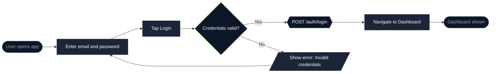

# Mermaid Diagrams

Conventions for generating Mermaid flow diagrams used in design specs. These are tech-stack agnostic — they document user flows regardless of whether the implementation is KMP, Go, or anything else.

---

## Diagram Type

Use `flowchart LR` (left-to-right) for user flows by default.
Use `flowchart TD` (top-down) for hierarchical structures or when the diagram becomes too wide.

---

## Node Shapes

| Role | Shape syntax | Example |
|---|---|---|
| Entry / exit point | Stadium `([text])` | `([User opens app])` |
| User action / process step | Rectangle `[text]` | `[Enter email address]` |
| Decision / branch | Diamond `{text}` | `{Valid credentials?}` |
| UI output (modal, toast, error) | Parallelogram `[/text/]` | `[/Show validation error/]` |
| API call / system operation | Hexagon `{{text}}` | `{{POST /api/login}}` |
| Sub-flow reference | Subroutine `[[text]]` | `[[Onboarding flow]]` |

---

## Node IDs

- Use descriptive camelCase IDs — never single letters
- IDs describe what the node represents, not a step number
- No step numbers in node labels (labels describe what happens)

```
✅ enterEmailStep[Enter email address]
✅ validateCredentials{Valid credentials?}
✅ showErrorToast[/Show "Invalid email" error/]

❌ A[Enter email address]
❌ step1[Step 1: Enter email]
```

---

## Decision Edges

Label every outgoing edge from a decision node:

```
validateCredentials{Valid credentials?}
validateCredentials -->|Yes| loadDashboard[Load dashboard]
validateCredentials -->|No| showErrorToast[/Show error toast/]
```

Never leave decision edges unlabelled.

---

## Annotations

Use annotation nodes to add explanatory notes without disrupting flow. Style them with a dashed border and muted colour, connected to the relevant node with `~~~`.

```
loadDashboard[Load dashboard]
note1[/JWT stored in keychain/]
loadDashboard ~~~ note1

classDef annotation fill:#2a2a2a,stroke:#555,stroke-dasharray:5 5,color:#aaa
class note1 annotation
```

Rules for annotations:
- No step numbers
- No emojis or icons
- Use the `annotation` classDef (muted, dashed border)

---

## Colour Scheme

Define a consistent `classDef` colour scheme at the end of every diagram:

```mermaid
classDef default fill:#1C2538,stroke:#374151,color:#F8FAFC
classDef decision fill:#0E1729,stroke:#9AE600,color:#F8FAFC
classDef endpoint fill:#0E1729,stroke:#374151,color:#9CA3AF
classDef sysop fill:#0E1729,stroke:#374151,color:#F8FAFC,stroke-dasharray:0
classDef annotation fill:#111827,stroke:#374151,stroke-dasharray:5 5,color:#6B7280
```

Apply classes after the node definitions:

```
class enterEmailStep,loadDashboard default
class validateCredentials decision
class startNode,exitNode endpoint
class postLogin sysop
class note1 annotation
```

---

## Subgraphs

Use subgraphs to group steps that belong to the same screen or phase:

```
subgraph loginScreen["Login Screen"]
    enterEmailStep[Enter email address]
    enterPasswordStep[Enter password]
    tapLoginButton[Tap Login]
end
```

---

## File Format

Save flow diagrams in `design-specs/flows/{flow-name}-mermaid.md`:

````markdown
# {Flow Title}

{2–3 sentence description of what this flow covers.}


## Notes

- {Any contextual notes that don't fit in the diagram}
````

---

## Quality Checklist

- [ ] Every decision node has labelled edges for all outcomes
- [ ] Node IDs are descriptive camelCase — not single letters
- [ ] Entry/exit points use stadium shapes `([text])`
- [ ] UI outputs (modals, toasts, errors) use parallelogram shapes `[/text/]`
- [ ] No step numbers in node labels — labels describe what happens
- [ ] No emojis or icons in annotation notes
- [ ] Annotations use dashed border and muted colour
- [ ] `classDef` styles defined at the end and applied consistently
- [ ] Diagram renders without syntax errors
- [ ] File saved with `-mermaid` suffix in `design-specs/flows/`

---

## Example — Simple Login Flow

````markdown
# Login Flow

User authentication journey from the login screen through to the main dashboard.


````
