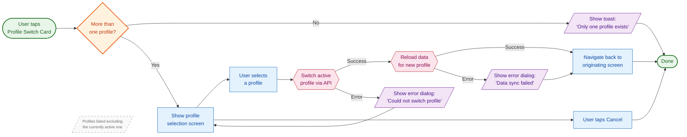
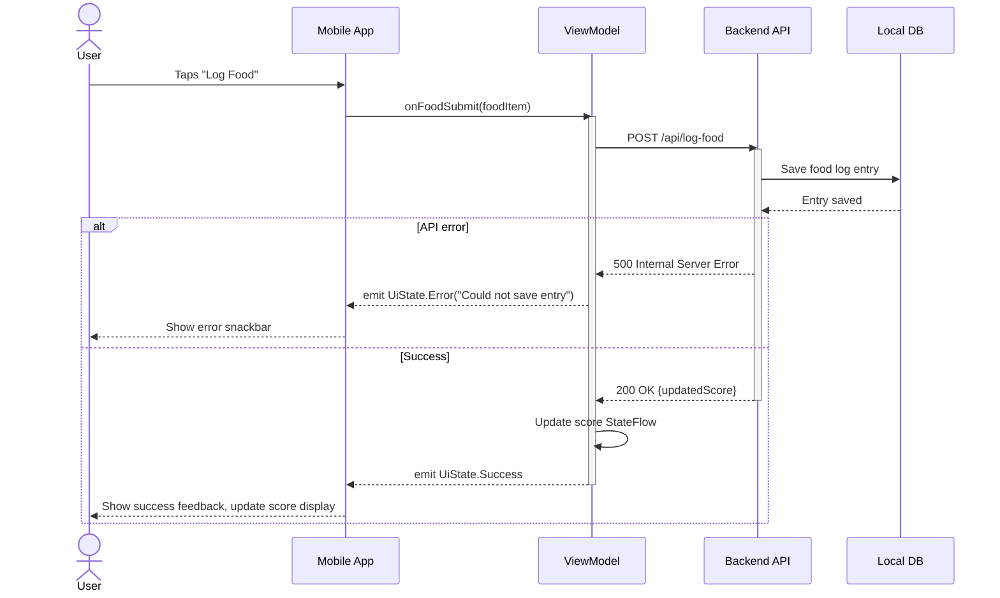
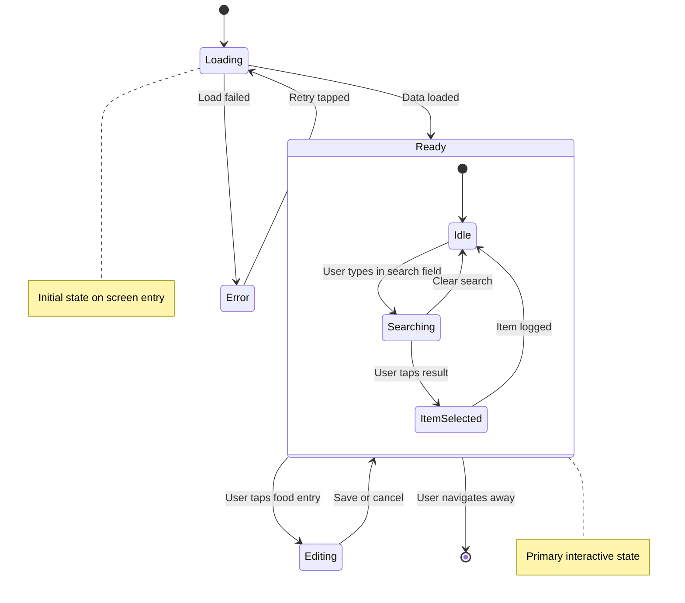
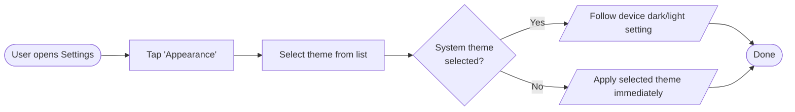
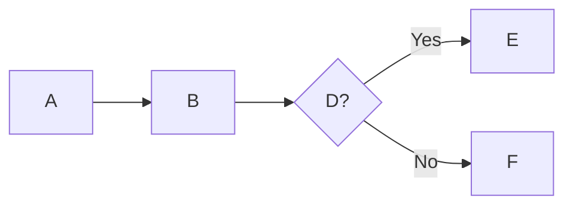
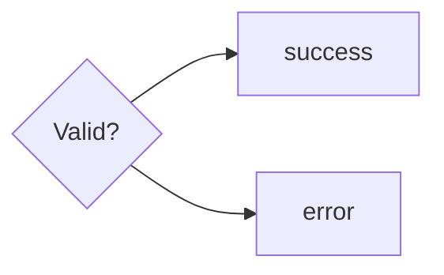

# Example Diagrams

Reference examples that demonstrate team conventions. Use these as templates when generating new diagrams.

## Example 1: Context Switch User Flow

This is the canonical example of our user flow style. It covers the profile context-switch flow including profile selection, confirmation, data reload, and error handling.



### Notes

- The `~~~` (invisible link) connects annotation nodes near their relevant step without adding an arrow
- Parallelogram nodes (`[/text/]`) represent any UI that appears to the user: dialogs, error messages, toasts
- Hexagon nodes (`{{text}}`) represent API/system operations
- The error recovery loop (`showError` → `showSelector`) shows how to handle cyclical flows

---

## Example 2: API Sync Sequence

Demonstrates sequence diagram conventions for API interactions.



---

## Example 3: Food Log Screen State Diagram

Demonstrates state diagram conventions for ViewModel/screen states.



---

## Example 4: Compact Flow (Simple Feature)

Not every diagram needs full styling. Small flows should be clean and minimal.



No `classDef` styling needed here — the flow is simple enough to read without colour coding.

---

## Anti-Patterns to Avoid

**Single-letter node IDs:**


**Missing decision labels:**


**Overuse of styling on small diagrams:**
```mermaid
%% BAD — 4 nodes don't need 6 class definitions
```

**Mixing flow directions:**
```mermaid
%% BAD — don't start LR then try to force TD sections
```
