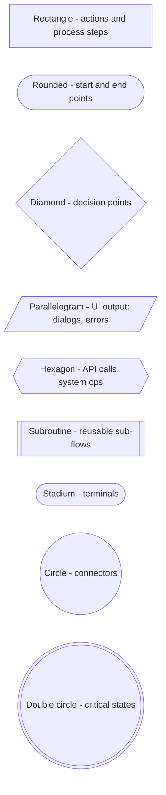
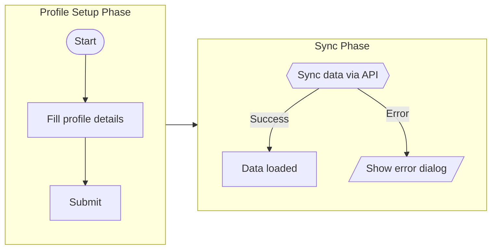
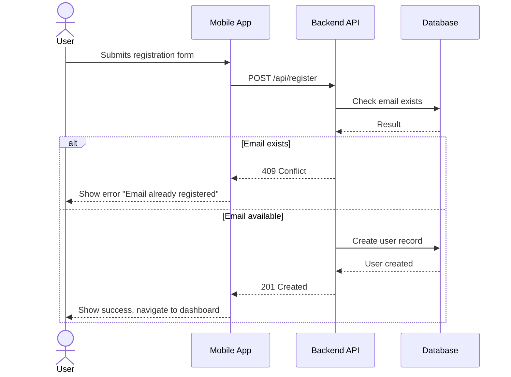
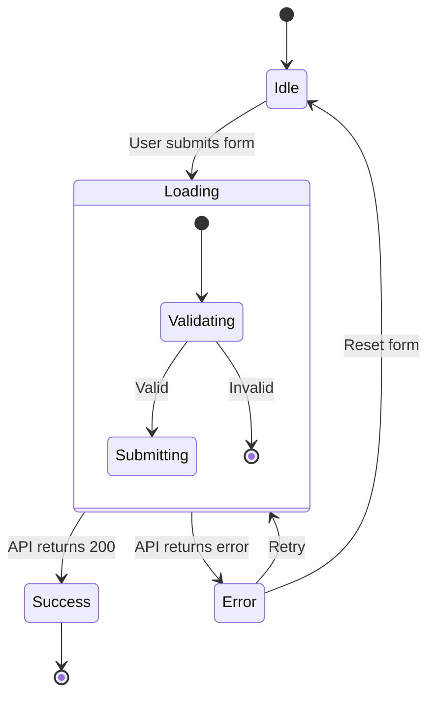
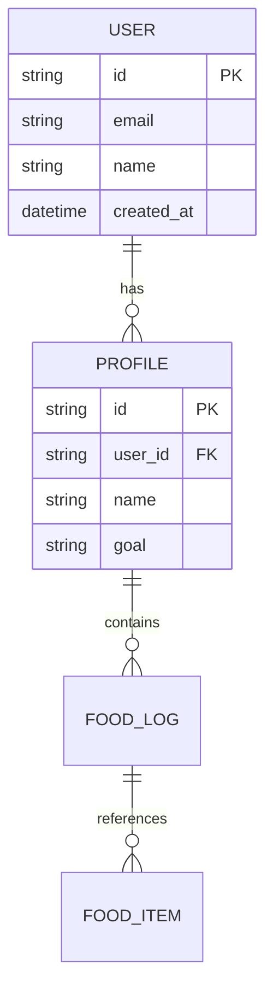
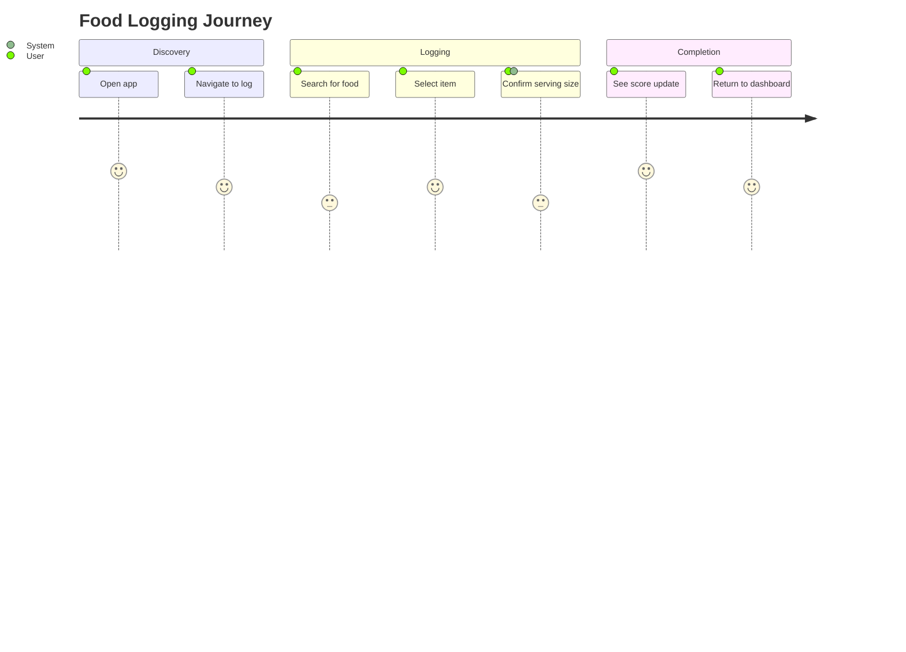

# Mermaid Syntax Cheatsheet

Curated reference for the Mermaid syntax we use. For the full specification, see https://mermaid.js.org.

## Flowcharts

### Direction

```
flowchart LR    %% Left to right (default for user flows)
flowchart TD    %% Top down (default for hierarchies)
flowchart RL    %% Right to left (rarely used)
flowchart BT    %% Bottom to top (rarely used)
```

### Node Shapes



### Edge Types

```mermaid
flowchart LR
    source --> target           %% Arrow
    source -->|label| target    %% Arrow with label
    source --- target           %% Line (no arrow)
    source ---|label| target    %% Line with label
    source -.-> target          %% Dotted arrow
    source -.->|label| target   %% Dotted arrow with label
    source ==> target           %% Thick arrow
    source ==>|label| target    %% Thick arrow with label
```

Use dotted arrows for optional or conditional paths.
Use thick arrows for the primary/happy path when emphasis helps readability.

### Subgraphs



Subgraphs can be linked as a unit using the subgraph ID.
Subgraph labels use the `["Label Text"]` syntax.

### Styling

**Class definitions:**
```mermaid
classDef startEnd fill:#e8f5e9,stroke:#2e7d32,stroke-width:2px,color:#1b5e20
classDef action fill:#e3f2fd,stroke:#1565c0,stroke-width:1px,color:#0d47a1
classDef decision fill:#fff3e0,stroke:#e65100,stroke-width:2px,color:#bf360c
classDef uiOutput fill:#f3e5f5,stroke:#6a1b9a,stroke-width:1px,color:#4a148c
classDef apiCall fill:#fce4ec,stroke:#b71c1c,stroke-width:1px,color:#880e4f
classDef note fill:#f9f9f9,stroke:#999,stroke-dasharray: 5 5,color:#666
```

**Applying classes:**
```mermaid
%% Inline syntax
startNode([Start]):::startEnd

%% Batch assignment
class startNode,endNode startEnd
class formStep,submitStep action
class isValid decision
```

**Individual node styling (use sparingly):**
```mermaid
style noteNode fill:#f9f9f9,stroke:#999,stroke-dasharray: 5 5
```

### Comments

```mermaid
%% This is a comment — not rendered in the diagram
```

Use comments to explain complex branching logic or non-obvious design decisions.

### Line Breaks in Labels

Use `<br/>` for line breaks inside node labels:
```mermaid
longLabel[Show a dialog with options.<br/>Include a dropdown for<br/>profile selection.]
```

---

## Sequence Diagrams

For API interactions and request/response flows.



**Key syntax:**
- `->>` solid arrow (request/action)
- `-->>` dashed arrow (response/return)
- `actor` for human participants
- `participant` for systems, with optional alias: `participant API as Backend API`
- `alt`/`else`/`end` for conditional branches
- `opt`/`end` for optional sections
- `loop`/`end` for repeated actions
- `Note over A,B: text` for annotations spanning participants
- `activate`/`deactivate` for showing active processing

---

## State Diagrams

For component states (e.g. screen states, ViewModel states).



**Key syntax:**
- `[*]` for start/end states
- `state Name { }` for nested/composite states
- Transitions: `StateA --> StateB: trigger`

---

## Entity Relationship Diagrams

For data models.



**Relationship syntax:**
- `||--||` one to one
- `||--o{` one to many
- `}o--o{` many to many
- `o` = zero or more, `|` = exactly one

---

## Journey Diagrams

For user experience mapping (lighter weight than flowcharts).



Scores are 1-5 (sentiment). Useful for quick UX mapping, not detailed technical flows.
